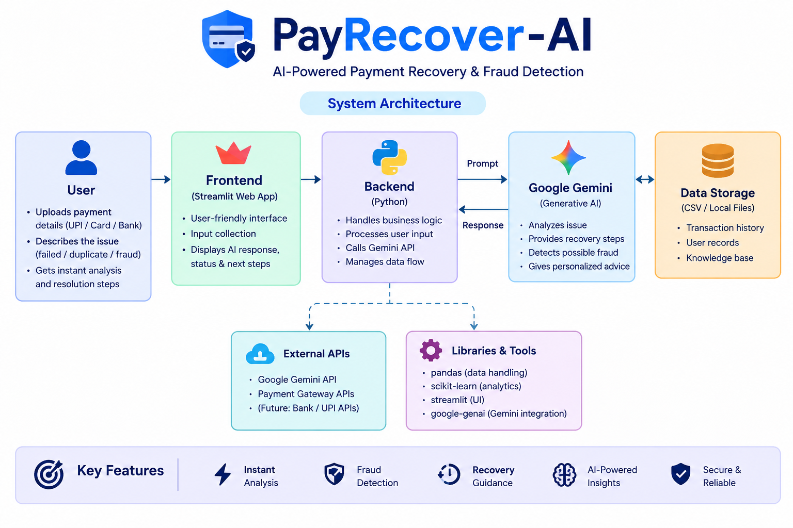

💰 PayRecover AI

Intelligent Revenue Recovery Agent

PayRecover AI is an AI-powered revenue recovery prototype designed to identify failed payments, understand the likely cause of failure, recommend an appropriate recovery strategy, and apply deterministic safety controls before any recovery action is approved.

«Core principle: The AI recommends. The Safety Engine decides.»

---

🎯 Project Objective

Failed payments can represent significant lost revenue for businesses. Blindly retrying payments can also create unnecessary risk, including repeated attempts and potential duplicate-charge scenarios.

PayRecover AI addresses this problem by combining AI-assisted payment analysis with deterministic safety controls.

The system:

- Detects and analyzes failed payments
- Classifies likely payment failure reasons
- Generates an AI-assisted recovery recommendation
- Selects a recovery strategy
- Applies deterministic safety rules
- Limits automatic payment retries
- Protects high-value transactions
- Simulates recovery outcomes
- Measures revenue recovery
- Records decisions through an audit trail
- Provides an interactive dashboard for monitoring and testing

---

🤖 How PayRecover AI Works

Payment Data
     │
     ▼
Failed Payment
     │
     ▼
AI Failure Analysis
     │
     ▼
Confidence + Diagnosis
     │
     ▼
Recovery Strategy
     │
     ▼
Deterministic Safety Engine
     │
     ├───────────────┐
     ▼               ▼
Approved          Blocked
     │               │
     ▼               ▼
Recovery Action   Escalation
     │
     ▼
Recovery Simulation
     │
     ▼
Revenue Metrics
     │
     ▼
Audit Trail + Dashboard

### 🏗️ Visual Architecture

---

🛡️ Safety Architecture

PayRecover AI separates AI recommendations from action authorization.

The AI can recommend an action, but deterministic safety rules have final authority.

Safety controls include:

- Maximum automatic retry protection
- High-value transaction protection
- Payment-status verification
- Idempotency-aware retry protection
- Invalid-action blocking
- Risk classification
- Automatic escalation
- Auditability of decisions

---

🔄 Recovery Strategies

Strategy| Purpose
RETRY| Attempt recovery for temporary payment failures
REMINDER| Prompt customers when insufficient funds may be the cause
UPDATE PAYMENT METHOD| Ask customers to update expired payment methods
ESCALATE| Stop automation when risk or uncertainty is high

---

🧠 AI Decision Layer

PayRecover AI uses Gemini for payment-failure analysis.

The AI analyzes:

- Failure description
- Payment amount
- Previous retry attempts

It produces:

- Failure diagnosis
- Confidence score
- Recommended action
- Safety concern

If Gemini is unavailable or quota is exhausted, the system uses a deterministic local fallback analysis.

«Gemini provides intelligence; deterministic safety rules remain responsible for authorization.»

---

🧪 Synthetic Data

This project uses synthetic payment data for demonstration and testing.

No real customer information or real payment transactions are processed.

---

📊 Dashboard

The Streamlit dashboard provides:

- Revenue at risk
- Revenue recovered
- Recovery rate
- Failure-reason analysis
- Recovery strategy distribution
- Risk distribution
- Safety approvals and blocks
- AI confidence
- Safety overrides
- Recovery outcomes
- Payment-level analysis
- Recovery audit trail

---

🧪 Interactive Safety Test

The dashboard includes an interactive payment-testing section.

Example:

Customer: safety_test
Amount: ₹5,000
Failure: payment gateway timed out
Previous Retry Attempts: 3

The system can demonstrate:

AI Recommendation
        ↓
Recovery Strategy: RETRY
        ↓
Safety Engine
        ↓
RETRY BLOCKED
        ↓
Final Action: ESCALATE

«The AI recommends. The Safety Engine decides.»

---

📈 Recovery Simulation

The prototype includes a synthetic recovery simulation to estimate potential recovery outcomes.

Illustrative recovery probabilities are used only for demonstration and evaluation.

They do not represent production payment performance.

---

📋 Audit Trail

Each analyzed payment records important decision information including:

- Payment ID
- Customer
- Amount
- AI recommendation
- Recovery strategy
- Final recovery action
- Safety status
- Safety override
- Risk level
- Risk score
- Recovery outcome
- Recovered amount

---

🏗️ Project Architecture

PayRecover-AI/
│
├── main.py
├── dashboard.py
├── ai_analyzer.py
├── gemini_agent.py
├── recovery_strategy.py
├── safety_engine.py
├── strategy_analysis.py
├── Payments.csv
├── architecture.png
├── requirements.txt
└── README.md

Architecture Flow

Payment Data
     ↓
AI Diagnosis
     ↓
Recovery Strategy
     ↓
Safety Engine
     ↓
Controlled Action
     ↓
Recovery Simulation
     ↓
Revenue & Audit Tracking

---

🛠️ Technology Stack

- Python
- Streamlit
- Pandas
- Google Gemini API
- Google GenAI SDK
- Scikit-learn
- Git & GitHub

---

🚀 Installation

Clone the repository:

git clone https://github.com/Jahnavimahadev/PayRecover-AI.git
cd PayRecover-AI

Install dependencies:

python -m pip install -r requirements.txt

---

🔑 Gemini API Setup

Create a Gemini API key through Google AI Studio.

Set the environment variable:

GEMINI_API_KEY

Never commit API keys to GitHub.

---

▶️ Run the Dashboard

python -m streamlit run dashboard.py

---

🤝 Responsible AI

PayRecover AI is designed around a human-safe automation principle.

The AI does not directly authorize financial actions.

Instead:

AI Recommendation
       ↓
Deterministic Safety Validation
       ↓
Approved / Blocked
       ↓
Controlled Final Action

---

🔮 Future Improvements

Potential future extensions include:

- Real-time payment-event integration
- Learning from historical recovery outcomes
- Advanced payment-failure prediction
- Fraud-aware recovery controls
- Multi-payment-method recovery
- Customer-specific recovery optimization
- Production-grade observability
- Human approval workflows for high-risk transactions

---

📌 Project Status

Prototype / Hackathon Build

The current implementation demonstrates the complete revenue-recovery decision workflow using synthetic payment data.

No real payments are processed.

---

⭐ Key Innovation

PayRecover AI combines:

AI intelligence + deterministic financial safety + measurable recovery

Instead of allowing an AI model to directly execute payment actions, the system creates a controlled decision pipeline where the AI proposes and the safety engine authorizes.

«The AI recommends. The Safety Engine decides.»

---

🔗 Repository

https://github.com/Jahnavimahadev/PayRecover-AI